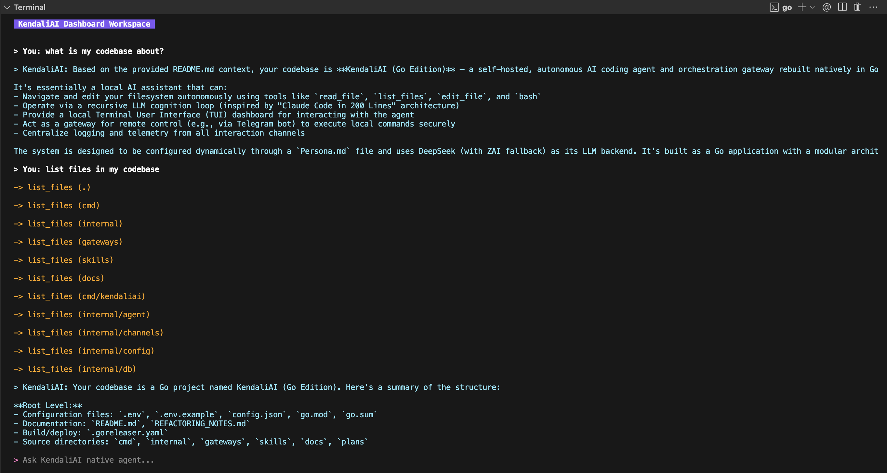
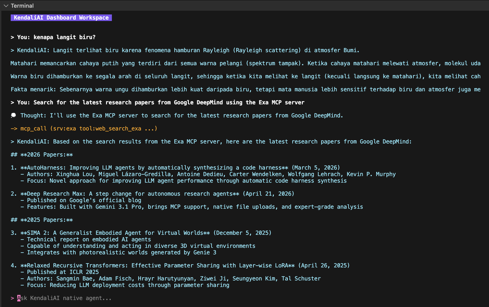
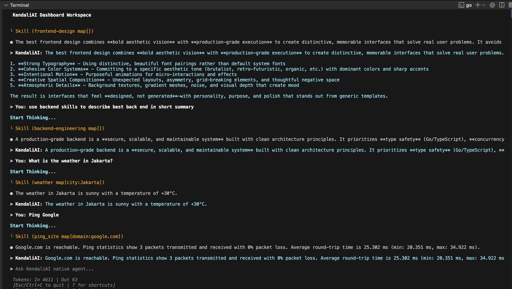
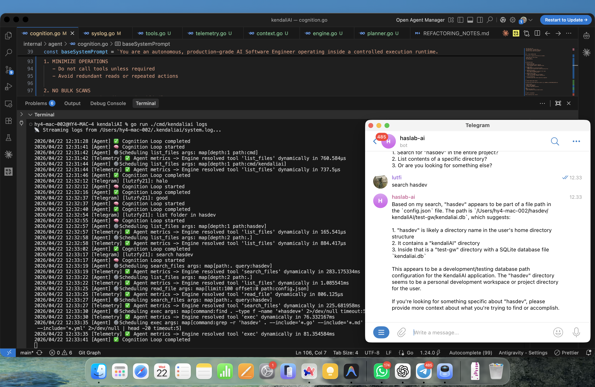

# KendaliAI (Go Edition)

KendaliAI is a self-hosted, autonomous AI coding agent and orchestration gateway rebuilt natively in Go. Influenced heavily by the "Claude Code in 200 Lines" architecture, KendaliAI uses dynamic tool invocation and recursive LLM cognition loops to navigate, evaluate, and edit your local filesystem.

## Features

- **Autonomous Cognition Loop**: Recursive OS-level operations (`read_file`, `list_files`, `edit_file`, `bash`) executed dynamically by models like DeepSeek.
- **Custom Skills System**: Extend the agent's capabilities with on-demand Markdown instructions or custom shell-based tools.
- **Dynamic Configured Persona**: Your AI's identity and restricted commands are defined dynamically in `~/.kendaliai/Persona.md`.
- **Local TUI Dashboard**: An interactive Terminal User Interface using BubbleTea for direct agent interaction.
- **Telegram Gateway**: Execute local terminal commands securely from your phone.
- **Centralized Telemetry Logging**: Stream OS Agent logs from all channels seamlessly.

## Quickstart

### 1. Build and Run

Ensure you have Go 1.24+ installed.

```bash
go mod tidy
```

### 2. Export API Keys

KendaliAI uses DeepSeek by default, with an optional fallback to ZAI.

```bash
export DEEPSEEK_API_KEY="your-api-key"
export ZAI_API_KEY="your-zai-key"
```

### 3. Initialize Gateway Database (Optional)

```bash
go run ./cmd/kendaliai onboard
```

### 4. Bind a Telegram Channel (Optional)

```bash
go run ./cmd/kendaliai channel bind-telegram --bot-token "YOUR_TOKEN"
```

## Running the Architecture

KendaliAI operates in natively decoupled environments. You can run one or multiple components completely asynchronously.

### Standalone Interactive TUI (Offline Agent)

Access the autonomous agent locally through a beautiful BubbleTea interface. Fully actionable terminal environment with live streaming output.



```bash
go run ./cmd/kendaliai tui
```

### MCP (Master Control Program)

The primary server that handles all incoming requests from channels and executes the autonomous agent.



### Custom Skills

KendaliAI supports two types of custom skills located in `~/.kendaliai/skills/`.

#### 1. Instructional Skills (.md)
Add specialized knowledge or guidelines by creating a Markdown file with YAML frontmatter. These are registered as "on-demand" tools that the agent calls to load expert instructions when needed.

**Example: `~/.kendaliai/skills/frontend-design.md`**
```markdown
---
name: frontend-design
description: Create distinctive, production-grade frontend interfaces.
---
## Principles
- Use modern typography (Outfit, Roboto).
- Avoid generic "AI slop" aesthetics.
- Prioritize CSS-only motion effects.
```

#### 2. Execution Skills (.sh + skills.json)
Add functional tools that execute shell scripts. These must be defined in `~/.kendaliai/skills/skills.json`.

**Example: `~/.kendaliai/skills/weather.sh`**
```bash
#!/bin/bash
curl -s "wttr.in/$1?format=3"
```

**Registering in `skills.json`:**
```json
{
  "skills": [
    {
      "id": "weather",
      "name": "Get Weather",
      "description": "Fetch current weather for a city.",
      "input_schema": {
        "type": "object",
        "properties": { "city": { "type": "string" } }
      },
      "execution": {
        "type": "shell",
        "command": "./weather.sh",
        "args_mapping": { "city": "$1" }
      },
      "installed": true
    }
  ]
}
```




### Headless Gateway (Telegram Bot)

Starts the primary server and polls attached Telegram bots.



```bash
go run ./cmd/kendaliai gateway
```

### Centralized Logistics Stream

Watch the autonomous agent think, execute tools, and respond in real-time across the entire platform.

```bash
go run ./cmd/kendaliai logs
```

## System Structure

```text
cmd/kendaliai/       # Primary CLI entrypoints (root, tui, gateway, logs)
internal/
├── agent/           # The Core Cognition Loop & Native Tool Registry
├── channels/        # external polling wrappers (Telegram)
├── config/          # Viper environment mapping
├── db/              # SQLite workspace storage
├── gateways/        # State handlers
├── logger/          # Central syslog mapping
├── providers/       # LLM abstraction (DeepSeek, ZAI)
├── security/        # Identity security
├── server/          # REST Gateway wrappers
└── tui/             # Charmbracelet Bubbletea reactive loop
```

## Security & Restricting Commands

Your agent is strictly bounded to the rules specified inside `~/.kendaliai/Persona.md`. If this file doesn't exist, KendaliAI will generate it upon execution.

To restrict commands from being blindly executed natively by the agent, define them under `exclude_cmd:` in the file:

```markdown
# Agent Identity

**Name:** KendaliAI

tools: read_file, list_files, edit_file, bash
exclude_cmd: rm, ls ., modify root file
```
