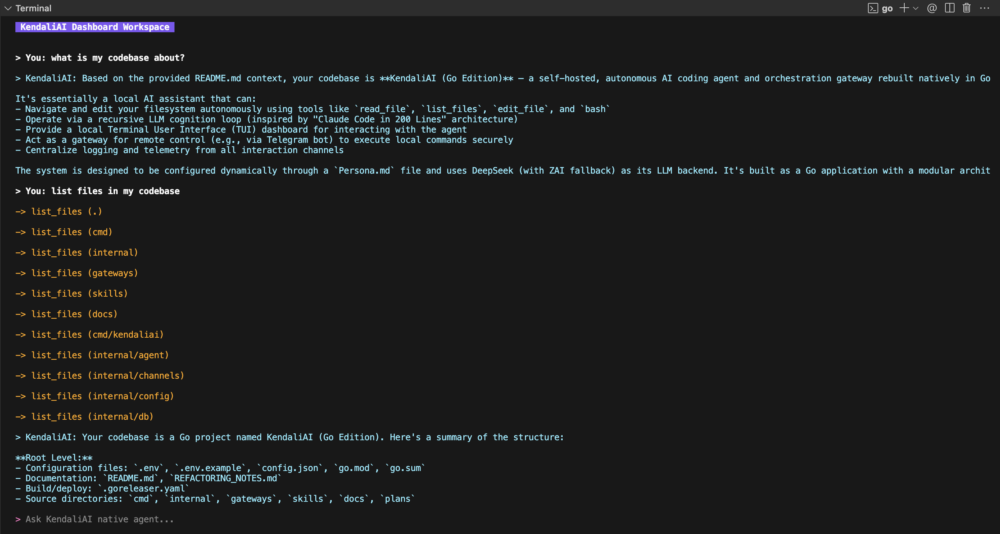
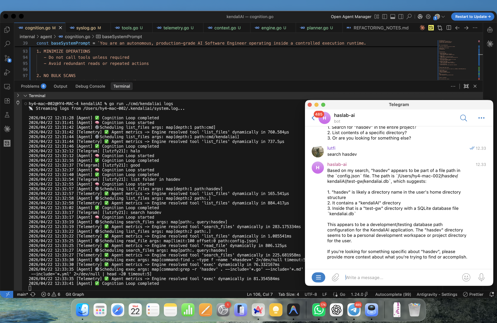

# KendaliAI (Go Edition)

KendaliAI is a self-hosted, autonomous AI coding agent and orchestration gateway rebuilt natively in Go. Influenced heavily by the "Claude Code in 200 Lines" architecture, KendaliAI uses dynamic tool invocation and recursive LLM cognition loops to navigate, evaluate, and edit your local filesystem.

## Features

- **Autonomous Cognition Loop**: Recursive OS-level operations (`read_file`, `list_files`, `edit_file`, `bash`) executed dynamically by models like DeepSeek.
- **OpenAI-Compatible Provider**: Works with any OpenAI-compatible endpoint (DeepSeek, OpenAI, Groq, Ollama, etc.) — just change `config.json`.
- **Custom Skills System**: Extend the agent's capabilities with on-demand Markdown instructions or custom shell-based tools.
- **Dynamic Configured Persona**: Your AI's identity and restricted commands are defined dynamically in `~/.kendaliai/Persona.md`.
- **Local TUI Dashboard**: An interactive Terminal User Interface using BubbleTea for direct agent interaction.
- **Telegram Gateway**: Execute local terminal commands securely from your phone.
- **Centralized Telemetry Logging**: Stream OS Agent logs from all channels seamlessly.

## Quickstart

### Prerequisites

- Go 1.24+
- CGO (required by `go-sqlite3`)

### 1. Configure

All configuration lives in `config.json`. Copy the example and fill in your credentials:

```bash
cp config.example.json config.json
```

```json
{
  "chatProvider": {
    "type": "deepseek",
    "endpoint": "https://api.deepseek.com/v1",
    "model": "deepseek-v4-flash",
    "apiKey": "your-api-key"
  },
  "embedding": {
    "endpoint": "https://api.openai.com/v1",
    "model": "text-embedding-3-small",
    "apiKey": "your-embedding-api-key"
  },
  "channel": {
    "type": "telegram",
    "botToken": "your-telegram-bot-token"
  }
}
```

**Config resolution order:**
1. `KENDALIAI_CONFIG` env var (explicit override)
2. `./config.json` (development — local file)
3. `~/.kendaliai/config.json` (production — home directory)

> **`channel` is optional.** Without it, only TUI mode works. When you run `onboard` or `gateway`, you'll see instructions on how to add a channel.

### 2. Install Dependencies

```bash
make tidy
```

### 3. Onboard

Creates the gateway database and auto-binds the channel from config:

```bash
make dev-onboard
```

## Running

### Development

Uses `./config.json` automatically (no install needed):

```bash
# Run TUI dashboard
make dev-tui

# Run headless gateway (Telegram bot + API server)
make dev-gateway

# Run any command
make dev-<command>
```

### Production

```bash
# Build optimized binary
make build-prod

# Install binary + config to system
make install

# Run
kendaliai tui
kendaliai gateway
```

`make install` copies the binary to `/usr/local/bin/` and `config.json` to `~/.kendaliai/config.json` (if not already present).

## Makefile Targets

| Target | Description |
|---|---|
| `make build` | Build debug binary to `./build/` |
| `make build-prod` | Build optimized binary (stripped, no symbols) |
| `make install` | Build + install to `/usr/local/bin/` + copy config |
| `make dev` | Run via `go run` (no build step) |
| `make dev-tui` | Run TUI dashboard |
| `make dev-gateway` | Run headless gateway |
| `make dev-onboard` | Initialize gateway + bind channel from config |
| `make dev-logs` | Run log streamer |
| `make tidy` | Run `go mod tidy` |
| `make lint` | Run `go vet` |
| `make clean` | Remove build artifacts |

## Architecture

KendaliAI operates in natively decoupled environments. You can run one or multiple components completely asynchronously.

### Standalone Interactive TUI (Offline Agent)

Access the autonomous agent locally through a BubbleTea interface. Fully actionable terminal environment with live streaming output.



```bash
make dev-tui        # development
kendaliai tui       # production
```

### Headless Gateway (Telegram Bot)

Starts the primary server and polls attached Telegram bots.



```bash
make dev-gateway    # development
kendaliai gateway   # production
```

### Centralized Logistics Stream

Watch the autonomous agent think, execute tools, and respond in real-time across the entire platform.

```bash
make dev-logs       # development
kendaliai logs      # production
```

### Custom Skills

KendaliAI supports two types of custom skills located in `~/.kendaliai/skills/`.

#### 1. Instructional Skills (.md)
Add specialized knowledge or guidelines by creating a Markdown file with YAML frontmatter. These are registered as "on-demand" tools that the agent calls to load expert instructions when needed.

**Example: `~/.kendaliai/skills/frontend-design.md`**
```markdown
---
name: frontend-design
description: Create distinctive, production-grade frontend interfaces.
---
## Principles
- Use modern typography (Outfit, Roboto).
- Avoid generic "AI slop" aesthetics.
- Prioritize CSS-only motion effects.
```

#### 2. Execution Skills (.sh + skills.json)
Add functional tools that execute shell scripts. These must be defined in `~/.kendaliai/skills/skills.json`.

**Example: `~/.kendaliai/skills/weather.sh`**
```bash
#!/bin/bash
curl -s "wttr.in/$1?format=3"
```

**Registering in `skills.json`:**
```json
{
  "skills": [
    {
      "id": "weather",
      "name": "Get Weather",
      "description": "Fetch current weather for a city.",
      "input_schema": {
        "type": "object",
        "properties": { "city": { "type": "string" } }
      },
      "execution": {
        "type": "shell",
        "command": "./weather.sh",
        "args_mapping": { "city": "$1" }
      },
      "installed": true
    }
  ]
}
```

## System Structure

```text
cmd/kendaliai/       # Primary CLI entrypoints (root, tui, gateway, logs)
internal/
├── agent/           # The Core Cognition Loop & Native Tool Registry
├── channels/        # External polling wrappers (Telegram)
├── config/          # Config singleton (config.json)
├── db/              # SQLite workspace storage
├── gateways/        # State handlers
├── logger/          # Central syslog mapping
├── providers/       # OpenAI-compatible provider (any endpoint)
├── security/        # Identity security
├── server/          # REST Gateway wrappers
└── tui/             # Charmbracelet Bubbletea reactive loop
```

## Security & Restricting Commands

Your agent is strictly bounded to the rules specified inside `~/.kendaliai/Persona.md`. If this file doesn't exist, KendaliAI will generate it upon execution.

To restrict commands from being blindly executed natively by the agent, define them under `exclude_cmd:` in the file:

```markdown
# Agent Identity

**Name:** KendaliAI

tools: read_file, list_files, edit_file, bash
exclude_cmd: rm, ls ., modify root file
```

## Switching Providers

KendaliAI uses a single OpenAI-compatible provider. To switch models or providers, just edit `config.json`:

```json
{
  "chatProvider": {
    "type": "openai",
    "endpoint": "https://api.openai.com/v1",
    "model": "gpt-4o",
    "apiKey": "sk-..."
  }
}
```

Works with any OpenAI-compatible API: DeepSeek, OpenAI, Groq, Together, Ollama, LM Studio, etc.
